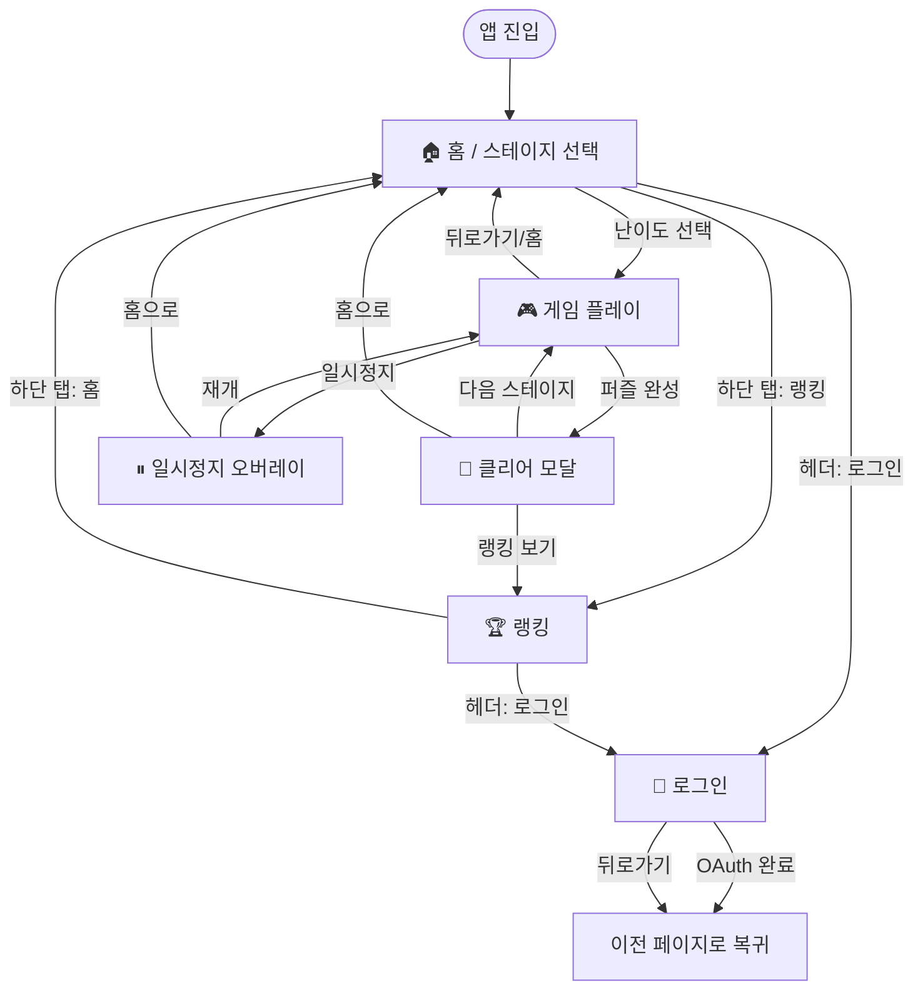
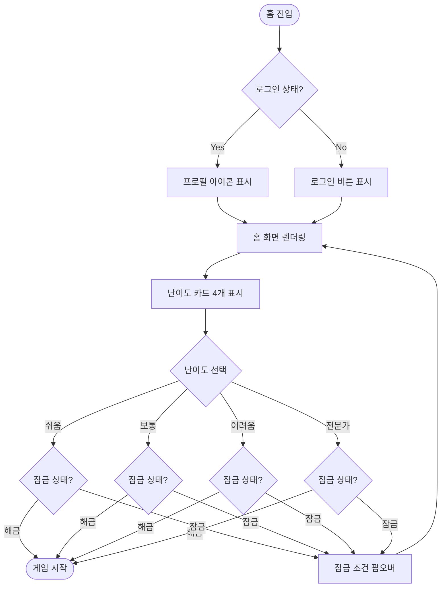
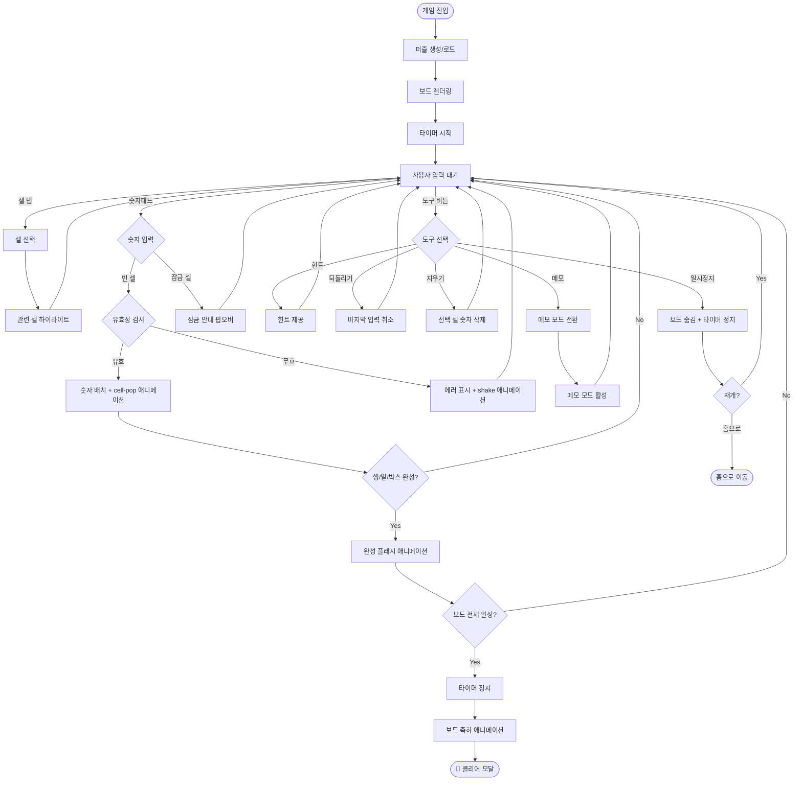
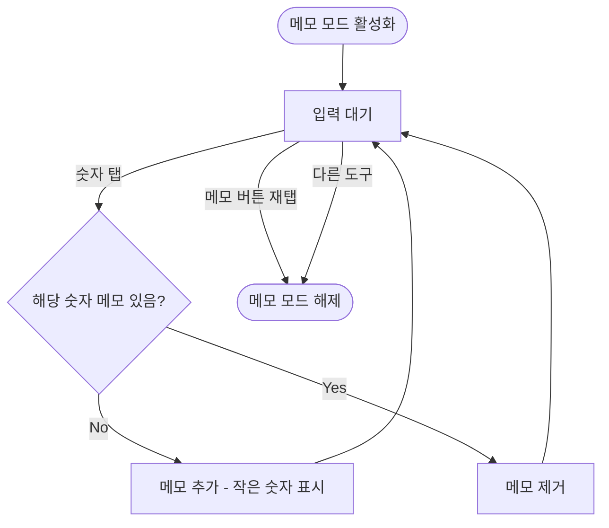
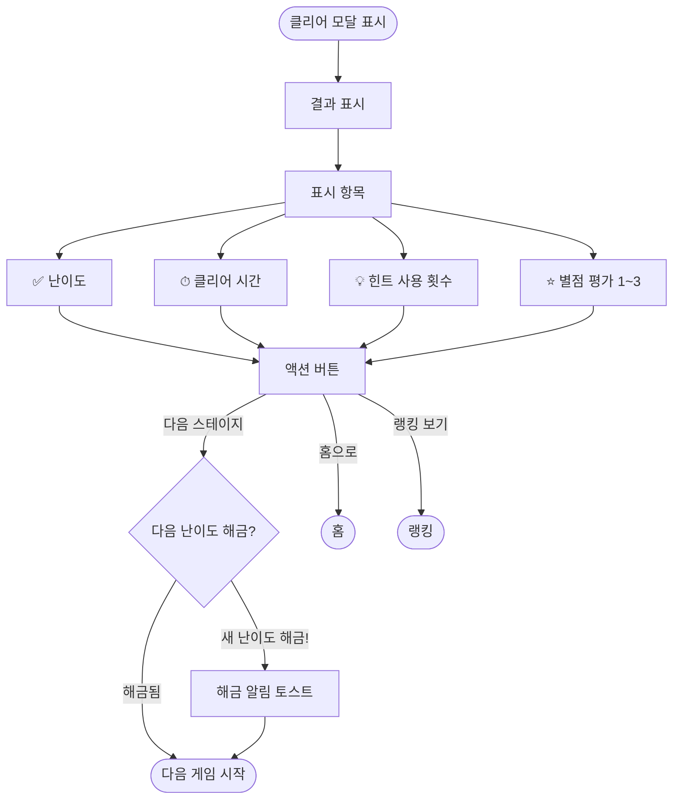
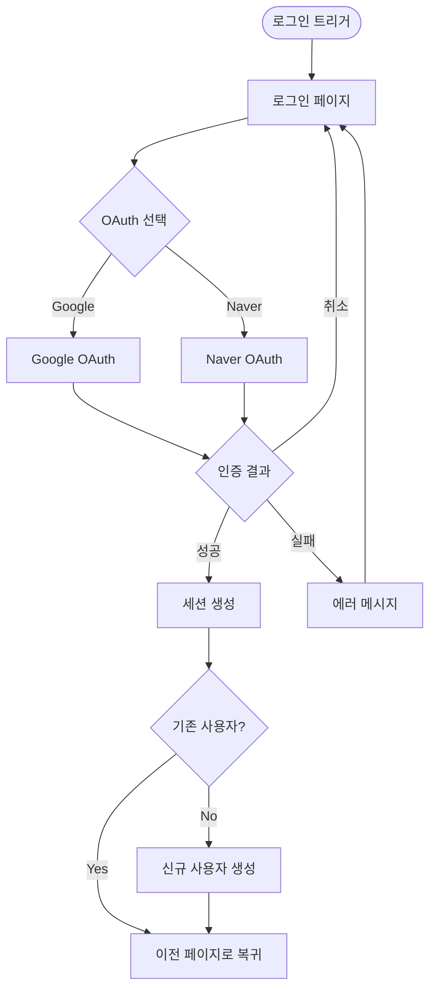
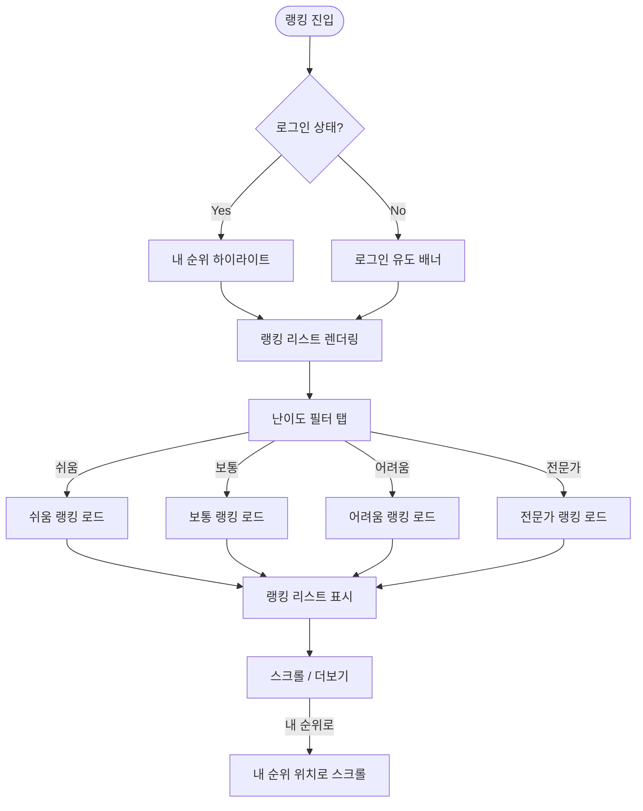
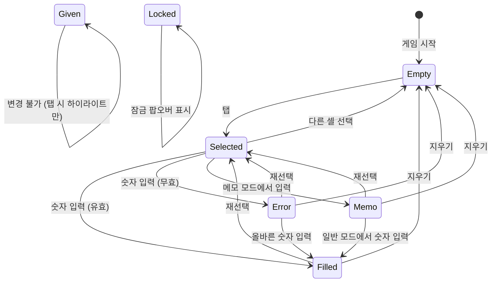
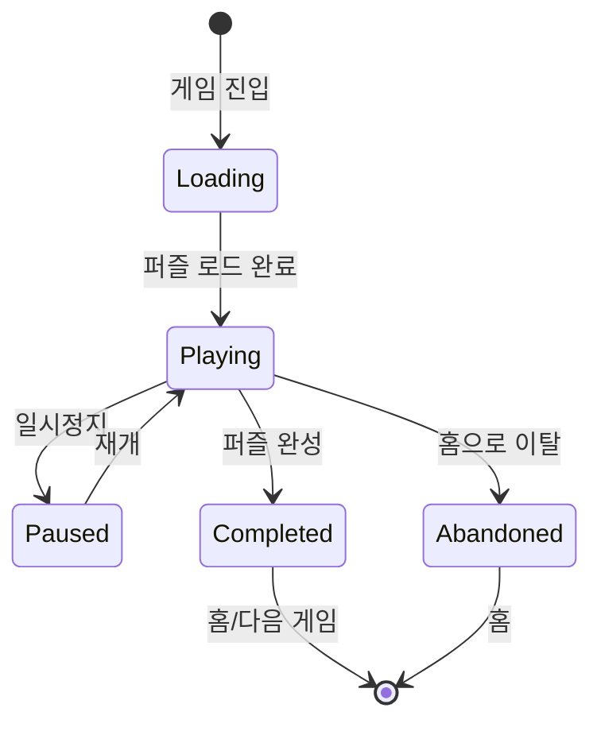

# 🖌 UX 플로우 (User Experience Flow)

> 스도쿠 웹앱의 전체 유저 여정을 정의한다.
> 모든 페이지 간 이동 경로, 인터랙션 분기, 상태 전환을 포함한다.

---

## 1. 전체 앱 구조 (Site Map)

```
/                    → 홈 (스테이지 선택)
/game?d={난이도}     → 게임 플레이
/ranking             → 랭킹
/login               → 로그인
```

> 단 4개 페이지로 구성. 미니멀한 구조로 사용자 혼란 최소화.

---

## 2. 전체 유저 여정 (Master Flow)



---

## 3. 페이지별 상세 플로우

### 3.1 홈 (스테이지 선택) 플로우



**난이도별 해금 조건:**

| 난이도 | 해금 조건 | 기본 상태 |
|--------|----------|----------|
| 쉬움 (Easy) | 없음 (항상 해금) | 🔓 열림 |
| 보통 (Medium) | 쉬움 1스테이지 클리어 | 🔒 잠금 |
| 어려움 (Hard) | 보통 1스테이지 클리어 | 🔒 잠금 |
| 전문가 (Expert) | 어려움 1스테이지 클리어 | 🔒 잠금 |

---

### 3.2 게임 플레이 플로우



---

### 3.3 메모 모드 플로우



**메모 표시 방식:**
- 셀 내부를 3×3 그리드로 분할
- 각 숫자(1-9)는 고정된 위치에 작은 글씨로 표시
- 해당 숫자를 실제로 입력하면 메모 자동 삭제

```
┌───────────┐
│ 1   2   3 │
│ 4   5   6 │
│ 7   8   9 │
└───────────┘
```

---

### 3.4 클리어 모달 플로우



**별점 평가 기준:**

| 별점 | 조건 |
|------|------|
| ⭐⭐⭐ | 힌트 0회 + 시간 기준 이내 |
| ⭐⭐ | 힌트 1~2회 또는 시간 초과 |
| ⭐ | 힌트 3회 이상 |

---

### 3.5 인증 플로우



**인증이 필요한 시점:**
- 랭킹 등록 (게임 클리어 후)
- 게임 진행 기록 저장 (자동)
- 랭킹 페이지에서 "내 기록" 필터

> ⚠️ **게임 플레이 자체는 비로그인으로 가능**. 클리어 후 랭킹 등록 시점에만 로그인 유도.

---

### 3.6 랭킹 플로우



**랭킹 표시 항목:**

| 순서 | 항목 | 설명 |
|------|------|------|
| 1 | 순위 | 1, 2, 3... (상위 3위 특별 표시) |
| 2 | 프로필 | 아바타 + 닉네임 |
| 3 | 클리어 시간 | MM:SS 형식 |
| 4 | 별점 | ⭐ 1~3개 |
| 5 | 날짜 | 클리어 일시 |

---

## 4. 네비게이션 구조

### 4.1 공통 레이아웃

```
┌─────────────────────────────────┐
│  Header (로고 / 뒤로가기 / 로그인)  │
├─────────────────────────────────┤
│                                 │
│         페이지 콘텐츠             │
│                                 │
├─────────────────────────────────┤
│  BottomNav (홈 / 랭킹)           │
└─────────────────────────────────┘
```

### 4.2 Header 분기

| 페이지 | 좌측 | 중앙 | 우측 |
|--------|------|------|------|
| 홈 | 로고 | — | 로그인/프로필 |
| 게임 | ← 뒤로 | 난이도 + 타이머 | 일시정지 |
| 랭킹 | 로고 | "랭킹" | 로그인/프로필 |
| 로그인 | ← 뒤로 | "로그인" | — |

### 4.3 BottomNav

| 탭 | 아이콘 | 표시 조건 |
|----|--------|----------|
| 홈 | `Home` | 항상 (게임 화면 제외) |
| 랭킹 | `Trophy` | 항상 (게임 화면 제외) |

> 🎮 **게임 화면에서는 BottomNav 숨김** — 숫자패드가 하단을 차지하므로.

---

## 5. 인터랙션 상태 전환 맵

### 5.1 셀 상태 전환



### 5.2 게임 상태 전환



---

## 6. 에러 & 엣지 케이스

### 6.1 에러 처리 플로우

| 상황 | 처리 | UX |
|------|------|-----|
| 네트워크 오류 (랭킹 로드) | 재시도 버튼 | "연결에 실패했습니다. 다시 시도해주세요." |
| OAuth 실패 | 로그인 페이지 유지 | "로그인에 실패했습니다. 다시 시도해주세요." |
| 세션 만료 | 자동 로그아웃 | 토스트: "세션이 만료되었습니다." |
| 퍼즐 생성 실패 | 재생성 시도 | 로딩 스피너 유지 → 3회 실패 시 에러 화면 |

### 6.2 엣지 케이스

| 상황 | 처리 |
|------|------|
| 게임 중 새로고침 | 로컬 스토리지에서 진행 상태 복원 |
| 게임 중 브라우저 닫기 | 다음 접속 시 이어하기 제안 |
| 같은 퍼즐 재도전 | 기록 초기화, 새 타이머 시작 |
| 모든 힌트 소진 | 힌트 버튼 비활성화 (최대 3회) |
| 오프라인 모드 | 게임 플레이 가능, 랭킹 저장 보류 → 온라인 복귀 시 동기화 |

---

## 7. 화면 전환 애니메이션

| 전환 | 애니메이션 | Duration |
|------|-----------|----------|
| 페이지 → 페이지 | Fade (opacity 0→1) | 200ms |
| 모달 표시 | Slide up + Fade | 300ms |
| 모달 닫기 | Slide down + Fade | 200ms |
| 팝오버 표시 | Scale(0.96→1) + Fade | 200ms |
| 토스트 표시 | Slide down from top | 300ms |
| 토스트 사라짐 | Slide up + Fade | 200ms |

---

## 8. 접근성 (A11y) 플로우

### 8.1 키보드 네비게이션

| 키 | 동작 |
|----|------|
| `←` `→` `↑` `↓` | 보드 내 셀 이동 |
| `1` ~ `9` | 선택된 셀에 숫자 입력 |
| `Backspace` / `Delete` | 선택된 셀 숫자 삭제 |
| `Tab` | 다음 인터랙티브 요소로 이동 |
| `Escape` | 모달/팝오버 닫기 |
| `Space` / `Enter` | 버튼 활성화 |

### 8.2 스크린 리더

| 요소 | aria-label 예시 |
|------|----------------|
| 셀 (빈) | "3행 5열, 비어있음" |
| 셀 (숫자) | "3행 5열, 값 7" |
| 셀 (에러) | "3행 5열, 값 7, 오류" |
| 셀 (잠금) | "3행 5열, 잠김" |
| 숫자패드 | "숫자 5 입력" |
| 힌트 버튼 | "힌트 사용, 남은 횟수 2" |
| 타이머 | "경과 시간 3분 24초" |
